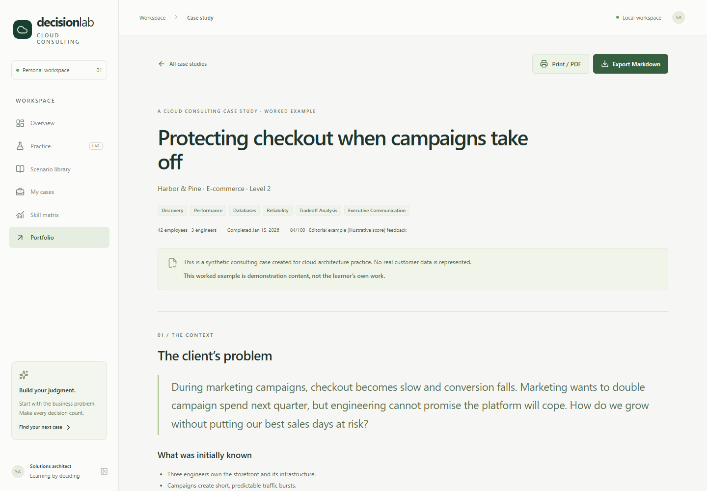

# Cloud Consulting Decision Lab

The current public catalog focuses on **48 cloud architecture decisions**. Previous consulting and PE scenarios are retained in reserve, with historical cases preserved. Start with ECS/EC2, databases, networks, resilience and migrations, then explore data pipelines and AI architecture. See [the cloud portfolio guide](docs/CLOUD_PORTFOLIO.md) for a suggested practice sequence.

**Practice the decisions, not just the services.**

Cloud labs teach me how to build infrastructure. This project trains me to decide what should be built, why it fits the business, which trade-offs it accepts, and how to defend that decision.

Decision Lab is a local consulting simulator. Synthetic companies arrive with incomplete problems: lost sales, spiraling costs, overloaded engineers, unreliable releases or expensive AI features. The learner investigates, compares architectures, records a decision and explains it to technical and business stakeholders.

**The AI plays the client and reviewer. The learner remains the architect.** The first analysis is permanently recorded before review. Every suggestion needs an explicit accept, partially accept or reject decision with a rationale.

## Run locally

Requires **Node.js 22.13 or newer** and npm. Node 24 LTS is recommended.

```bash
npm install
npm run dev
```

Open [the local workspace](http://127.0.0.1:3000). No account, API key, migration command or database setup is needed. SQLite and scenarios initialize automatically. The server binds to loopback by default.

```bash
npm test           # domain, provider, persistence and invariant tests
npm run typecheck  # strict TypeScript
npm run build     # production build
npm start         # production server locally
npm run test:e2e   # complete consulting flow and mobile layout
```

Playwright uses installed Google Chrome. Alternatively run `npx playwright install chromium` and remove `channel: 'chrome'` from `playwright.config.ts`. E2E tests use a separate database and port 3100.

## What it trains

- **48 active cloud architecture scenarios across five levels**, plus 158 earlier scenarios kept in reserve. Historical attempts and portfolio records remain available.
- **Four assistance modes**, independent of difficulty: guided, standard, hard and expert. PE practice is available from Level 1.
- **Technology → Value findings**, linking technical evidence to operations, customers, business, finance, action and confidence.
- **Comparable unit economics and value realization**, separating identified opportunity, verified savings, capacity, avoidance, offsets and implementation costs.
- **Client discovery**, with selective disclosure and separate facts, assumptions, unknowns and requirements.
- **Evidence requests** when the consultant does not yet have enough information to decide.
- **Architecture alternatives**, ten trade-off dimensions and written reasoning.
- **Requirement traceability**, including satisfied, at-risk and unaddressed needs.
- **Simplicity and decision boundaries**, with observable signals for reconsideration.
- **Validation plans**, with hypotheses, metrics, success and exit criteria or justified alternatives.
- **Immutable accepted ADRs**, with explicit supersession when decisions change.
- **Communication for engineers, CTOs, CFOs and CEOs**, plus optional analogies and service-free explanations.
- **First and final snapshots**, a reasoning comparison and justified review responses.
- **Ten scoring dimensions for upgraded simulations**, with critical misses that force revision regardless of score; original cases retain their eight-dimensional rubric.
- **Portfolio case studies**, Markdown and ZIP work-product exports, financial bridge CSV, print styles and Mermaid diagrams.
- **Learning path and attempt history**, contextual glossary, metric driver maps, debriefs and executive defense rounds.
- **Skill coverage and progress**, calculated from personal cases, separate from worked examples.

There is no universal service answer key. Managed compute can fit one team and be the wrong trade-off for another. The question is whether the recommendation follows from the evidence and requirements.

## A consulting session

Upgraded simulations use a compact path for beginners:

```text
Brief → Discovery and evidence → Technical / Economics / Value analysis
  → Options and trade-offs → Recommendation → Audience communication
  → Sealed first analysis → Review and executive defense → Final revision
  → Evaluation and debrief → Portfolio and work products
```

Levels 3–5 add change conditions, validation and accepted ADRs. Advanced cases require executive work products; mega-cases add ten staged workstream chapters. `/learn` offers a recommended progression while the full library remains open. Start with **AWS spend rose 55%. Is that bad?**: the same brief can hide materially different unit economics, fixed for the lifetime of the case.

Cases started before the upgrade retain the original path:

```text
Brief → Discovery → Framing → Options → Trade-offs
  → Recommendation → Why not simpler? → Change my mind
  → Validation → ADR → Communication
  → Sealed first analysis → Review → My response → Final revision
  → Evaluation → Portfolio
```

Completion gates run on the server. Advancing saves the current draft first. Use **Save draft** before leaving an unfinished step; resume from **My cases**. Evaluated cases are read-only until reopened. Reopening removes the current publication and evaluation while preserving every ADR and snapshot.

## AI providers

### Mock mode — default

The mock client matches scenario-specific discovery topics in English or French, returning only a small amount of relevant information. It can report missing measurements, approximate answers or available evidence. Asking it to choose an architecture does not reveal a solution.

Upgraded simulations freeze private truth at case creation. Interviews enforce stakeholder topic knowledge; documents may require earlier records or later chapters. Deterministic v2 scoring reconciles requested financial evidence and checks causal completeness, uncertainty and source-backed defenses. It uses limited keyword indicators and remains formative, not a substitute for expert review.

Review uses the learner's draft, discovered topics and requirements. Scoring combines structural completeness, traceability, evidence, audience differentiation and explicit risk checks. **It is formative feedback, not a guarantee that an architecture is correct.** Mock scenario generation creates clearly labeled variations of curated cases.

### OpenAI mode — optional

Copy `.env.example` to `.env.local` and configure:

```dotenv
AI_PROVIDER=openai
AI_API_KEY=your-api-key
AI_MODEL=your-available-model-id
DATABASE_PATH=./data/decision-lab.sqlite
```

Restart after configuration changes. The official SDK runs server-side. The provider boundary supports client simulation, evidence, review, communication evaluation and validated generation. Keys never enter the browser; no secret uses a `NEXT_PUBLIC_` variable.

Live mode sends relevant scenario data and learner-authored content to the provider. Use synthetic practice material rather than customer secrets. Live calls require your own API access. Mock mode is fully usable without it.

For upgraded cases, evidence and interviews remain deterministic and private-state controlled. Live mode can supply review and communication feedback; v2 numeric evaluation remains deterministic. Generated variations currently use the classic contract and workflow. No live-provider verification is implied by local mock tests.

## Architecture

| Layer             | Implementation                                                |
| ----------------- | ------------------------------------------------------------- |
| Application       | Next.js App Router, React, strict TypeScript                  |
| Interface         | Accessible components, Tailwind CSS, scoped CSS, Lucide       |
| Validation        | Zod at API and generated-scenario boundaries                  |
| Persistence       | SQLite, better-sqlite3 and Drizzle                            |
| Consulting engine | Server state machine, traceability, immutable records         |
| Simulation        | Private scenarios, deterministic mock and official OpenAI SDK |
| Documentation     | Mermaid strict mode, Markdown, print-friendly showcase        |
| Verification      | Vitest, Playwright, TypeScript and production build           |

Scenarios and case drafts are typed JSON aggregates in SQLite. ADRs and snapshots occupy separate append-only tables with database triggers rejecting changes. A unique index prevents a second first-analysis snapshot. Writes use transactions and optimistic version checks. Requirement IDs increment monotonically even after deletion.

An explicit public allow-list controls scenario data crossing the API boundary. Hidden facts, architecture patterns, evaluation criteria and red flags remain server-side. Discovery returns relevant responses instead of sending all hidden content to the browser.

```text
src/
  app/                 Pages and API routes
  components/          Dashboard, library, consulting steps, showcase
  data/                Professional skill matrix and worked example
  lib/
    ai/                Provider interface, prompts, implementations
    scenarios/         Private seeds, schema and disclosure matching
    cases/             State machine, transactions and actions
    db/                Drizzle schema and SQLite initialization
    adr/               Acceptance, immutability and supersession
    requirements/      Stable IDs and traceability
    evaluation/        Weighted rubric and critical misses
    lab/               Consulting schemas, truth/evidence engine, finance, coaching, rubric and ZIP exports
    types.ts           Shared contracts
    validation.ts      Zod input schemas
    export.ts          Markdown and reasoning comparison
tests/                 Unit, integration and browser tests
docs/                  Original product vision
```

The schema initializes idempotently. Future schema changes should introduce versioned migrations. To back up work, stop the application and copy the SQLite database and associated WAL/SHM files, or use SQLite's backup mechanism.

## Portfolio use



Complete a case, resolve critical misses and select **Publish to local portfolio**. `/showcase/[caseId]` presents the full case and before/after reasoning trail. **Export Markdown** produces a document suitable for GitHub. Use browser printing for PDF.

Publishing adds a case to the locally served showcase; it does not deploy a website. There is no authentication or multi-user authorization. Add those controls and persistent storage before exposing private workspace routes to the internet.

Every showcase and export states:

> This is a synthetic consulting case created for cloud architecture practice. No real customer data is represented.

The project does not claim real consulting engagements or certify seniority. Budgets and performance figures are fictional learning inputs, not current AWS prices or guarantees.

## Deliberate scope

No billing, teams, subscriptions, SSO or social features. SQLite keeps setup simple; aggregates keep the long workflow understandable. The mock matcher is limited, and semantic dialogue benefits from a live provider. Scores cannot establish production readiness.

The original rationale is preserved in [the product vision](docs/PRODUCT_VISION.md).

See the [upgrade audit](docs/UPGRADE.md) and [scenario authoring guide](docs/SCENARIO_AUTHORING.md) for schema contracts, new content, evidence, stakeholders, variants, difficulty, scoring and migration conventions. The current bank sits within the requested 120–160-case range and remains designed for further editorial refinement.
