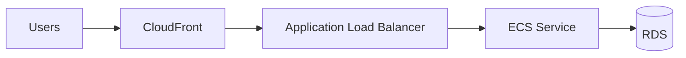

# Cloud Consulting Decision Lab

> **Practice the decisions, not just the services.**

Cloud labs teach me how to build infrastructure.

**Cloud Consulting Decision Lab trains me to decide what should be built, why it should be built, what trade-offs are being accepted, and how to explain that decision to both technical and business stakeholders.**

This project is a business-first simulation environment for practicing the work of a **Cloud Solutions Architect / Cloud Consultant**.

Synthetic companies present incomplete, realistic cloud problems such as:

- “Our AWS bill almost doubled and the engineering team is afraid to touch production.”
- “Our site slows down during campaigns and we are losing sales.”
- “Our developers spend too much time maintaining infrastructure.”
- “Deployments keep breaking production.”
- “We need to leave our datacenter in six months.”
- “We expect 10–15x more traffic, but we do not know whether our architecture can survive it.”
- “We launched an AI feature and inference costs are growing faster than revenue.”

The application does **not** immediately ask me to choose an AWS service.

Instead, I must act as the consultant.

I need to:

1. understand the business problem;
2. conduct discovery;
3. separate facts from assumptions and unknowns;
4. identify measurable requirements;
5. determine what the real problem is;
6. compare multiple architecture options;
7. document trade-offs;
8. recommend a solution;
9. justify why a simpler solution is not enough;
10. document what would make me change my mind;
11. define how the recommendation should be validated;
12. create an Architecture Decision Record;
13. explain the same decision to an engineer, CTO, CFO and CEO;
14. receive AI-generated criticism only **after** my first analysis is stored;
15. accept, partially accept or reject that feedback;
16. produce a final decision and portfolio-ready case study.

The objective is not to memorize AWS services.

The objective is to develop **architecture judgment**.

---

## Why I Built This

Many junior cloud portfolios prove that someone can launch infrastructure, deploy containers, use Terraform or follow an AWS tutorial. Those are important technical skills, but they do not fully demonstrate the work of a Solutions Architect.

A real architecture decision usually begins earlier:

> What is the actual business problem?

> What information is still missing?

> Which constraints matter?

> What is the cost of failure?

> Is the technically strongest solution operationally realistic for this team?

> Which trade-off is acceptable for this company?

> Why this architecture instead of a simpler one?

> What evidence would make us revisit the decision?

> How should the decision be explained to engineering, finance and leadership?

Cloud Consulting Decision Lab exists to deliberately practice those questions.

It complements hands-on infrastructure projects and certifications by focusing on the part that is harder to demonstrate in a traditional lab:

**reasoning, consulting, communication and decision-making under uncertainty.**

---

# Core Philosophy

The application follows one fundamental rule:

## The AI is not the architect.

The learner is.

The AI may act as:

- a simulated customer;
- a CTO;
- a CFO;
- an engineer;
- a reviewer;
- a skeptical stakeholder;
- a sparring partner.

But the AI should not solve the case before the learner has reasoned through it.

The intended workflow is:

```text
BUSINESS PROBLEM
        ↓
DISCOVERY
        ↓
FACTS / ASSUMPTIONS / UNKNOWNS
        ↓
REQUIREMENTS
        ↓
PROBLEM FRAMING
        ↓
ARCHITECTURE OPTIONS
        ↓
TRADE-OFFS
        ↓
RECOMMENDATION
        ↓
WHY NOT SOMETHING SIMPLER?
        ↓
WHAT WOULD CHANGE MY MIND?
        ↓
VALIDATION / POC
        ↓
ADR
        ↓
MULTI-AUDIENCE COMMUNICATION
        ↓
AI REVIEW
        ↓
ACCEPT / PARTIAL / REJECT
        ↓
FINAL DECISION
        ↓
PORTFOLIO CASE STUDY
```

---

# Business-First Scenarios

Cases begin with a business problem, not an AWS multiple-choice question.

Bad scenario:

> Should this company use ECS or EKS?

Good scenario:

> Our engineering team is struggling to operate the platform as traffic grows. Releases are slowing down, infrastructure maintenance takes too much time, and the CTO wants Kubernetes because “that is what serious companies use.”

The learner must discover whether Kubernetes is actually justified.

Possible hidden considerations may include:

- engineering team size;
- operational maturity;
- traffic shape;
- current architecture;
- reliability expectations;
- cost constraints;
- RTO / RPO;
- deployment frequency;
- database behavior;
- observability gaps;
- security requirements;
- compliance;
- customer commitments;
- business growth;
- team skills.

The technical solution is therefore **discovered from the business context**.

---

# What the Lab Trains

The curriculum is designed around recurring Cloud Solutions Architect and consulting skills rather than around a service-by-service AWS syllabus.

Core domains include:

- client discovery;
- architecture decision-making;
- trade-off analysis;
- migration and modernization;
- FinOps;
- performance;
- scalability;
- reliability;
- high availability;
- disaster recovery;
- RTO / RPO;
- networking;
- security;
- IAM;
- databases;
- storage;
- containers;
- compute;
- asynchronous architecture;
- caching;
- observability;
- CI/CD;
- rollback;
- deployment strategies;
- Infrastructure as Code;
- operational burden;
- developer productivity;
- governance;
- executive communication;
- AI infrastructure;
- MLOps;
- GenAI cost, latency and security.

---

# Progressive Difficulty

The goal is to increase the difficulty of the **reasoning**, not merely increase the number of AWS services.

## Level 1 — Decision Fundamentals

Simple problems with a small number of constraints.

Examples:

- EC2 vs Fargate;
- Single-AZ vs Multi-AZ;
- fixed capacity vs autoscaling;
- cache vs no cache;
- simple cost optimization decisions.

The learner receives more guidance.

## Level 2 — Small Business Architecture

The learner begins combining several components while considering budget, engineering team size, availability, cost, performance, scaling and operational complexity.

## Level 3 — Consulting

Cases become deliberately incomplete. The learner may face an incorrect client assumption, several valid architectures, conflicting stakeholders, migration questions, FinOps pressure, reliability constraints and limited operational maturity.

## Level 4 — High-Stakes Architecture

Cases introduce critical migrations, peak events, large cloud spend, strict RTO/RPO, production incidents, database migrations, security, compliance and higher business risk.

## Level 5 — Cloud + AI Infrastructure

Advanced cases introduce inference architecture, RAG, MLOps, GPU utilization, managed vs self-hosted inference, model cost, latency, scaling, sensitive data, model observability and AI security.

---

# Mandatory Reasoning Mechanisms

The application includes eight mechanisms designed to strengthen professional architecture reasoning.

## 1. Facts / Assumptions / Unknowns

During discovery, information is separated into three categories.

### Facts

Confirmed information.

```text
- Engineering team: 3 people
- AWS spend: $18k/month
- Traffic peaks between 9 AM and 11 AM
```

### Assumptions

Things I currently believe but have not validated.

```text
- Workers appear to be stateless
- The database may be the main bottleneck
```

### Unknowns

Important information that is still missing.

```text
- RPO
- p99 latency
- Database connection count
```

This prevents assumptions from silently becoming facts.

---

## 2. “I Don't Have Enough Information Yet”

The application explicitly allows the learner to refuse to make a premature architecture decision.

Example:

> I would not recommend a 3-year compute commitment yet because we do not have a representative workload baseline.

The learner can request additional evidence such as CloudWatch metrics, request volume, p95/p99, error rate, database connections, cost breakdown, read/write ratio, utilization history, deployment frequency and outage history.

Some scenarios are intentionally designed so that the best initial decision is:

**measure first, decide second.**

---

## 3. Requirement IDs and Traceability

Requirements receive unique IDs:

```text
R01 — Monthly budget <= $15k
R02 — RTO <= 30 minutes
R03 — RPO <= 5 minutes
R04 — Team has only 3 engineers
R05 — Must tolerate 12x traffic spikes
```

Architecture decisions can then be linked back to those requirements.

Example:

```text
Decision:
Use ECS Fargate

Supports:
R04
R05

Trade-off:
R01 may be harder to satisfy than with ECS on EC2
```

This creates a clear trace from **business requirement → architecture decision → status/risk**.

---

## 4. “Why Not Something Simpler?”

Before finalizing a recommendation, the learner must answer:

> Why is a simpler solution not enough?

Examples:

- Why EKS instead of ECS?
- Why Multi-Region instead of Multi-AZ?
- Why microservices instead of keeping a modular monolith?
- Why Aurora Global Database instead of a simpler RDS design?

The goal is to build an anti-overengineering reflex.

---

## 5. Immutable Architecture Decision Records

Architecture decisions are stored as ADRs.

```text
ADR-001
Title: Use ECS Fargate for application workloads
Status: Accepted
```

Once accepted, an ADR becomes immutable.

If the context changes, the original decision is not silently rewritten.

```text
ADR-002
Title: Move ECS workloads from Fargate to EC2

Supersedes:
ADR-001

Reason:
Compute became stable and significantly larger.
```

This preserves the history of the reasoning.

---

## 6. “What Would Change My Mind?”

Every recommendation must define observable conditions that would trigger reconsideration.

```text
Current decision:
ECS Fargate

Reconsider if:
- compute becomes stable for 30 days;
- average utilization remains above 70%;
- Fargate compute exceeds a defined monthly threshold;
- the team develops stronger platform operations capability.
```

Architecture decisions are therefore expressed as:

> This is the best option **under the current conditions**.

Not:

> This technology is always best.

---

## 7. AI Advice: Accept / Partially Accept / Reject

AI feedback is provided only after the learner's first analysis has been stored.

Each AI review item must be classified as:

- **Accept**
- **Partially Accept**
- **Reject**

And every response requires a rationale.

Example:

```text
AI suggestion:
"Consider EKS because it provides greater scalability."

Decision:
REJECT

Reason:
Scalability is not the unresolved requirement.
The team has three engineers and no Kubernetes experience.
ECS already satisfies the scaling requirement with lower operational burden.
```

This makes the role of AI visible:

```text
MY FIRST ANALYSIS
        ↓
AI CHALLENGE
        ↓
MY RESPONSE
        ↓
FINAL DECISION
```

The project is explicitly designed to show **AI-augmented reasoning**, not AI-replaced reasoning.

---

## 8. POC Hypothesis + Success / Exit Criteria

When a recommendation needs validation, the learner creates a structured proof-of-concept plan.

```text
Hypothesis:
ECS Fargate can sustain peak traffic while keeping operational overhead low.

Metrics:
- p95 latency
- p99 latency
- error rate
- CPU
- memory
- task count
- estimated cost

Success criteria:
- p95 < 300 ms
- error rate < 0.5%
- sustain 1,500 req/s
- estimated cost stays within target

Exit criteria:
- p95 > 500 ms
- unstable scaling
- unacceptable projected cost

If validation fails:
Evaluate ECS on EC2 and investigate the remaining bottleneck.
```

The goal is to turn architecture opinions into testable hypotheses.

---

# Communication Studio

Architecture is not only about making a technically correct decision.

A Solutions Architect must communicate the same decision differently depending on the audience.

Every case includes four communication exercises.

## Engineer

Focus on implementation, protocols, deployment, failure modes, scaling, observability and technical limitations.

## CTO

Focus on architecture, maintainability, technical risk, team fit, scalability and long-term technical strategy.

## CFO

Focus on cost, financial risk, predictability, operational cost and business justification.

## CEO

Focus on revenue, customer impact, risk, growth, speed and strategic outcome.

The architecture does not change.

The explanation does.

---

# Explain It Without AWS Service Names

An optional exercise forces the learner to explain architectural patterns before naming AWS products.

Instead of:

> SQS + Lambda + DynamoDB

Explain:

> Requests that do not need to complete synchronously are placed in a durable queue so workers can process them independently and absorb bursts without blocking the user-facing application.

Only then map the pattern to AWS services.

This trains:

```text
PROBLEM
   ↓
ARCHITECTURAL PATTERN
   ↓
CLOUD SERVICE
```

rather than:

```text
PROBLEM
   ↓
MEMORIZED AWS PRODUCT
```

---

# Trade-Off Thinking

Many scenarios intentionally do not have a single correct architecture.

| Decision | Possible Trade-Off |
|---|---|
| ECS Fargate vs ECS on EC2 | operational simplicity vs infrastructure efficiency/control |
| ECS vs EKS | simplicity vs Kubernetes ecosystem/flexibility |
| RDS vs Aurora | simplicity/cost vs scaling/features |
| Single-AZ vs Multi-AZ | cost vs recovery/resilience |
| On-Demand vs Spot | predictability vs savings/interruption tolerance |
| Managed vs self-managed | operational burden vs control |
| Monolith vs microservices | simplicity vs independent scaling/deployment |
| Single-Region vs Multi-Region | complexity/cost vs regional resilience |

Evaluation therefore asks:

> Is the recommendation coherent with the discovered requirements?

Not:

> Did the learner pick the answer key?

---

# Example Scenario

## Business Brief

> We run a B2B SaaS product with 600 customers. Every morning between 9 AM and 11 AM, the platform slows down. Customers are complaining and our CTO wants to move everything to Kubernetes.

The initial brief does **not** reveal whether CPU is saturated, whether the database is the bottleneck, whether the application is stateless, how many engineers operate the system, how much downtime is acceptable, the budget, current database connections or whether traffic is predictable.

The learner must discover those facts before recommending an architecture.

A valid outcome might be:

> Kubernetes is not currently justified. The primary problem is database connection saturation during a predictable traffic window, and the current team does not have the operational capacity to manage additional platform complexity.

Another version of the scenario may reveal conditions under which Kubernetes becomes reasonable.

The context determines the decision.

---

# Scenario Library

The project is designed to include business-first cases covering:

- sales lost during traffic spikes;
- exploding AWS spend;
- overloaded engineering teams;
- risky deployments;
- datacenter migration;
- database bottlenecks;
- Black Friday / major traffic events;
- inappropriate Kubernetes pressure;
- weak observability;
- disaster recovery;
- global latency;
- security remediation;
- manual infrastructure;
- rapid SaaS growth;
- asynchronous workloads;
- storage growth;
- database migration with limited downtime;
- multi-account governance;
- cost vs reliability conflicts;
- database connection saturation;
- GenAI inference cost growth;
- RAG latency;
- sensitive data and AI;
- GPU underutilization;
- deadline vs architecture perfection.

---

# AI Usage

AI is intentionally constrained.

## AI acts as the customer

It:

- stays in character;
- reveals information only when relevant questions are asked;
- may say “I don't know”;
- may express incorrect technical beliefs;
- may represent a CTO, CFO, CEO or engineer;
- does not solve the architecture problem.

## AI acts as the reviewer

It reviews:

- discovery gaps;
- assumptions;
- unknowns;
- requirement coverage;
- architecture;
- trade-offs;
- FinOps;
- reliability;
- security;
- operational burden;
- team fit;
- overengineering;
- communication;
- validation strategy.

The reviewer challenges the learner.

It does not automatically rewrite the learner's architecture.

---

# Mock Mode

The application is designed to work without an external AI API.

Mock mode provides deterministic scenario behavior for development, testing, demos and portfolio review.

The mock client reveals hidden scenario information based on relevant discovery topics.

---

# Real AI Mode

Real AI providers can be configured server-side.

The provider abstraction is intended to support:

```text
respondAsClient()
reviewCase()
generateScenario()
evaluateCommunication()
```

API keys must never be exposed in client-side code.

See `.env.example` for configuration.

---

# Market Skill Matrix

The project includes a configurable skill matrix used to organize practice around professional capabilities such as:

- discovery;
- migration;
- modernization;
- FinOps;
- networking;
- databases;
- containers;
- reliability;
- security;
- CI/CD;
- observability;
- Infrastructure as Code;
- executive communication;
- trade-off analysis;
- AI infrastructure;
- MLOps.

The dashboard can track cases completed, average score, score evolution, skill coverage, strengths, weak areas and critical misses.

---

# Evaluation

Cases are scored across several dimensions.

| Area | Weight |
|---|---:|
| Discovery quality | 20 |
| Problem framing | 10 |
| Architecture | 15 |
| Trade-off reasoning | 20 |
| Cost / business reasoning | 10 |
| Security / reliability / operations | 10 |
| Communication | 10 |
| Limits / change-of-mind reasoning | 5 |
| **Total** | **100** |

The important question is:

> Does the recommendation logically follow from the information that was discovered?

---

# Critical Misses

A high numerical score does not automatically mean a case passes.

Examples of critical misses:

- ignoring RTO/RPO in a disaster recovery case;
- recommending a major financial commitment without a usage baseline;
- treating an assumption as a confirmed fact;
- proposing operational complexity the team cannot realistically manage;
- creating an obvious security exposure;
- ignoring sensitive data concerns in an AI workload.

A case can therefore show:

```text
Score: 86/100

Critical Miss:
RPO was never established despite a disaster recovery requirement.

Status:
Needs Revision
```

---

# Portfolio Mode

Completed cases can be published in a read-only showcase.

Every public case should clearly state:

> **Synthetic consulting case — created for cloud architecture practice. No real customer data is represented.**

A portfolio case may include:

- business problem;
- discovery highlights;
- facts / assumptions / unknowns;
- requirements;
- problem framing;
- architecture alternatives;
- trade-off matrix;
- final recommendation;
- why not something simpler;
- requirement traceability;
- what would change my mind;
- POC / validation plan;
- ADR;
- architecture diagram;
- engineer explanation;
- CTO explanation;
- CFO explanation;
- CEO explanation;
- first analysis;
- AI review;
- accepted/rejected AI feedback;
- final decision;
- lessons learned;
- skills demonstrated.

---

# Markdown Export

Each completed case can be exported as a GitHub-ready Markdown case study.

```text
# Case XX — Title

## Synthetic Case Disclaimer
## Business Problem
## Discovery
## Facts
## Assumptions
## Unknowns
## Requirements
## Problem Framing
## Architecture Options
## Trade-Off Matrix
## Recommendation
## Why Not Something Simpler?
## Requirement Traceability
## Risks
## What Would Change My Mind?
## Validation / POC
## Architecture Decision Record
## Communication
### Engineer
### CTO
### CFO
### CEO
## First Analysis
## AI Review
## My Response to AI Feedback
## Final Decision
## Lessons Learned
## Skills Demonstrated
```

---

# Architecture Diagrams

Cases can include lightweight Mermaid diagrams.



The diagram exists to support the decision, not replace the reasoning.

---

# Intended Tech Stack

The initial implementation is intended around:

- Next.js
- React
- TypeScript
- Tailwind CSS
- accessible component primitives
- SQLite
- Prisma or Drizzle
- Zod
- Mermaid
- Recharts
- Vitest
- Playwright

The project intentionally avoids unnecessary SaaS complexity such as billing, subscriptions, enterprise SSO, complex multi-tenancy, marketplaces and social features.

The focus is the architecture training workflow.

---

# Suggested Project Structure

```text
src/
├── app/
│   ├── page.tsx
│   ├── practice/
│   ├── scenarios/
│   ├── cases/
│   ├── showcase/
│   ├── skills/
│   └── api/
├── components/
│   ├── dashboard/
│   ├── case/
│   ├── discovery/
│   ├── architecture/
│   ├── communication/
│   ├── review/
│   └── ui/
├── lib/
│   ├── ai/
│   ├── scenarios/
│   ├── evaluation/
│   ├── adr/
│   ├── requirements/
│   └── db/
└── data/
    └── market-skill-matrix.ts
```

---

# Local Development

> These commands assume the implementation uses the intended Node.js / Next.js stack.

Clone the repository:

```bash
git clone <repository-url>
cd cloud-consulting-decision-lab
```

Install dependencies:

```bash
npm install
```

Copy environment configuration:

```bash
cp .env.example .env
```

Run the application:

```bash
npm run dev
```

Then open:

```text
http://localhost:3000
```

---

# AI Provider Configuration

Example:

```env
AI_PROVIDER=mock
AI_API_KEY=
AI_MODEL=
```

Use:

```text
AI_PROVIDER=mock
```

for local development without an API key.

Real providers should remain server-side.

---

# Testing

Run unit tests:

```bash
npm test
```

Run the production build:

```bash
npm run build
```

If Playwright is configured:

```bash
npx playwright test
```

Important behaviors to test include:

- accepted ADRs cannot be edited;
- superseding ADR relationships remain intact;
- requirement IDs are stable;
- hidden scenario information is not exposed prematurely;
- first reasoning snapshots remain immutable;
- AI review items support Accept / Partial / Reject;
- critical misses affect case status;
- the complete case workflow works end-to-end.

---

# What This Project Is Not

This is **not**:

- an AWS certification quiz;
- a service recommendation engine;
- an “AI designs your architecture” product;
- a collection of fake customer claims;
- proof of senior-level production experience;
- a replacement for hands-on cloud engineering.

It is a deliberate-practice environment.

Its job is to make architecture reasoning visible, repeatable and progressively harder.

---

# Portfolio Positioning

The intended story is:

```text
I CAN BUILD.
        +
I CAN DIAGNOSE.
        +
I CAN ANALYZE.
        +
I CAN MAKE TRADE-OFFS.
        +
I CAN COMMUNICATE.
        +
I CAN CONNECT TECHNICAL DECISIONS TO BUSINESS NEEDS.
        +
I CAN USE AI TO ACCELERATE LEARNING
WITHOUT OUTSOURCING MY THINKING.
```

The application itself is not the main achievement.

**The reasoning produced inside it is.**

---

# Disclaimer

All company scenarios in this repository are synthetic and created for educational and portfolio purposes.

No scenario should be interpreted as a claim of work completed for a real customer unless explicitly stated otherwise.

---

## Final Principle

> **Do not start with the AWS service. Start with the business problem.**

That principle drives the entire project.
